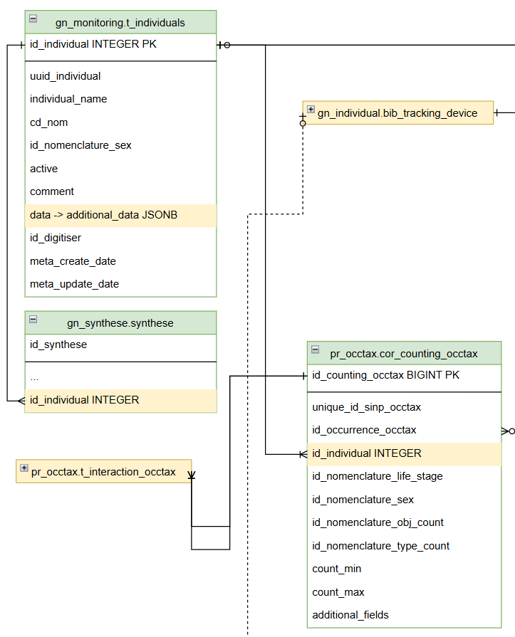
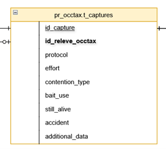
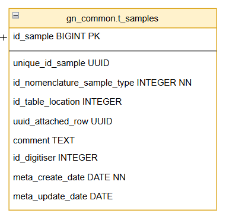
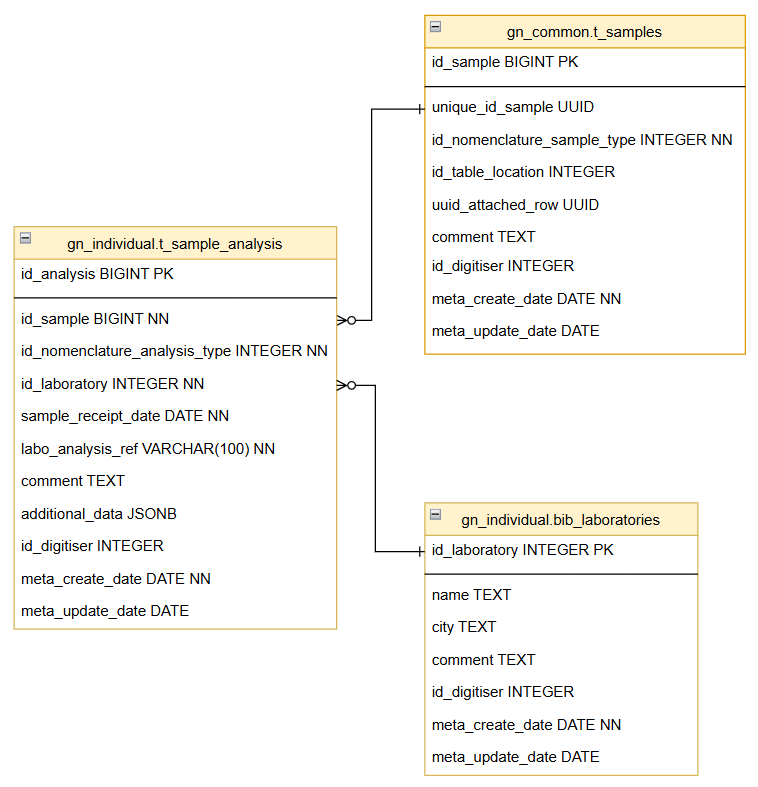
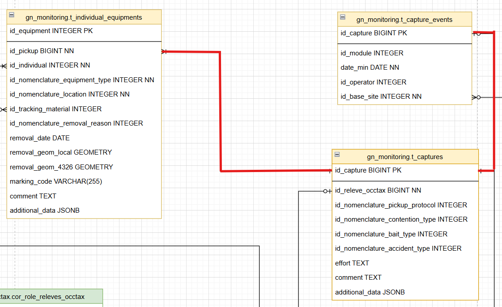
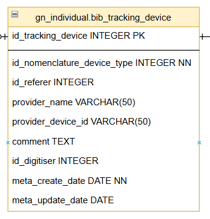
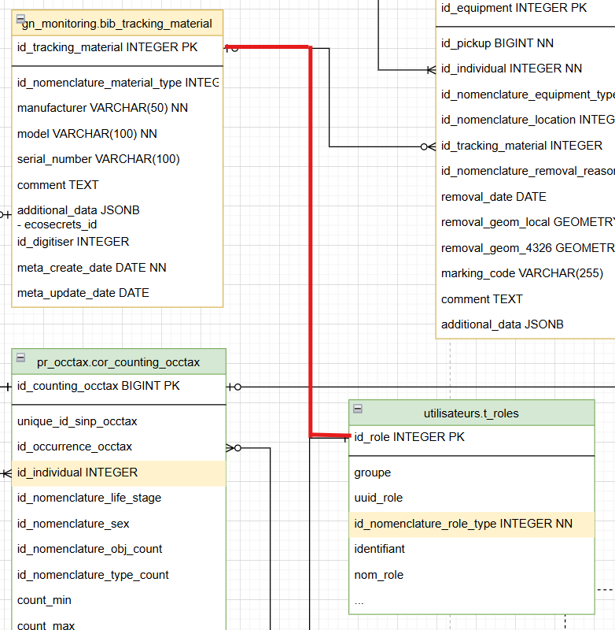
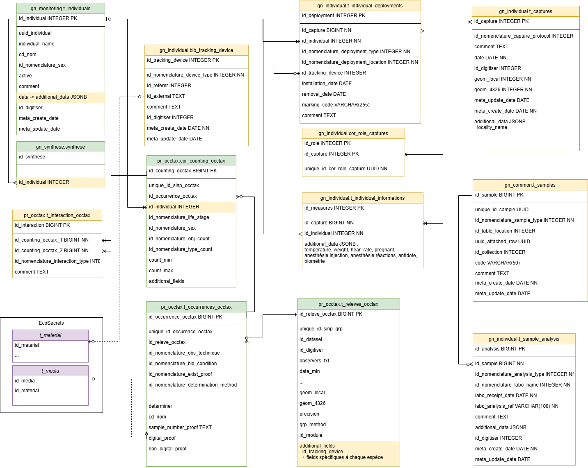

# Cahier des charges pour la solution de suivi et gestion d’individus

*Projet européen Cross-DBio*

*Autrice : Cynthia Borot - Parc National de la Vanoise*

- [Cahier des charges pour la solution de suivi et gestion d’individus](#cahier-des-charges-pour-la-solution-de-suivi-et-gestion-dindividus)
  - [Contexte et besoin](#contexte-et-besoin)
  - [Objectifs](#objectifs)
  - [Données concernées](#données-concernées)
    - [La capture](#la-capture)
    - [Les prélèvements d’échantillons](#les-prélèvements-déchantillons)
    - [Les individus](#les-individus)
    - [Les marquages](#les-marquages)
    - [Les émetteurs/balises](#les-émetteursbalises)
    - [Biométrie](#biométrie)
    - [Les résultats d'analyse d'échantillons effectués en laboratoire](#les-résultats-danalyse-déchantillons-effectués-en-laboratoire)
    - [Observation d'un individu marqué par un être humain](#observation-dun-individu-marqué-par-un-être-humain)
    - [Observation via un émetteur](#observation-via-un-émetteur)
    - [Observation via un capteur type piège photo](#observation-via-un-capteur-type-piège-photo)
  - [Architecture](#architecture)
  - [Modèle de données relationnel](#modèle-de-données-relationnel)
    - [Gestion des individus](#gestion-des-individus)
      - [Individus](#individus)
      - [Interactions](#interactions)
    - [Captures et échantillons](#captures-et-échantillons)
      - [Prélèvements / captures](#prélèvements--captures)
      - [Echantillons](#echantillons)
      - [Analyse des échantillons](#analyse-des-échantillons)
    - [Marquages et équipements d'un individu](#marquages-et-équipements-dun-individu)
    - [Bibliothèque de matériel](#bibliothèque-de-matériel)
    - [Types de sujet d’observation](#types-de-sujet-dobservation)
    - [Modèle de données complet](#modèle-de-données-complet)

## Contexte et besoin
Le Parc national de la Vanoise (PNV) et le Parc national du Grand Paradis (PNGP) partagent un patrimoine naturel exceptionnel, avec des milieux alpins similaires et des espèces emblématiques communes. Les populations animales, notamment le bouquetin des Alpes, se déplacent ponctuellement entre les deux territoires, ignorant les frontières administratives. Cette continuité écologique nécessite une approche transfrontalière de la gestion et du suivi de la biodiversité.

Les deux parcs ont développé, au fil des années, des protocoles de suivi rigoureux qui ont généré une masse considérable de données : plus de 1500 bouquetins capturés et marqués, des dizaines de milliers de données GPS issues du suivi télémétrique de différentes espèces (bouquetins, gypaètes barbus, aigles royaux, tétras-lyres), et une quantité croissante d'images issues des pièges photographiques. Ces données, d'une valeur scientifique inestimable, sont actuellement stockées dans des formats et sur des supports variés, rendant leur exploitation complexe et limitée.

De plus, l’avancée dans les technologies de deep learning ouvre des perspectives prometteuses pour le traitement et la valorisation des données issues de piège photo. Cependant, leur exploitation nécessite une restructuration préalable des données actuelles sous forme de base de données relationnelles selon des standards communs.

Cette harmonisation permettra non seulement d'optimiser l'exploitation des données existantes, mais aussi de faciliter le partage d'informations, via des outils simples d’usage et standardisés, entre les deux parcs puis avec la communauté scientifique.

## Objectifs
Cette application vise à :
- Rationnaliser la récolte des données de suivi des individus marqués : suivi dynamique de population, veille sanitaire, données issues après post-traitement de pièges photo …
- Centraliser ces données
- Faciliter la réalisation de bilans et l’aide à la décision : optimiser le suivi en permettant aux agents une interrogation des données existantes (repérage des sites préférentiels, connaissance de la date des dernières observations)
- Permettre, via des exports et/ou des interrogations directes à la base de données, de mieux valoriser ces données sur des cartographies faciles à réaliser et adaptées aux différents besoins (animations scolaires, partenaires)
- Faciliter la récupération des données pour les futures analyses et travaux de recherche (CMR, réseaux sociaux, analyse de reproduction, analyse spatiale, taille des groupes etc.) avec nos partenaires et futurs collaborateurs
- Proposer une consultation grand public des déplacements des individus

Elle remplacera au parc national de la Vanoise :
- Le tableur « BDD bouquetins »
- La base de données « Bouquetins marqués »
- Le portail de gestion et de visualisation des données GPS « GPS 3 vallées » (plus fonctionnel). 

## Données concernées

Les données relatives aux individus devront être centralisées dans une base de données relationnelle, permettant de stocker toutes les données listées ci-après.

### La capture

- Nom de/des personnes ayant capturé
- Géolocalisation
- Lieu-dit
- Date de capture
- Type de capture
- Température
- Poids
- Rythme cardiaque
- Echographie
- Anesthésie / antidote :
  - Nombre de tests injection (=nb tirs)
  - Distance
  - Heure injection anesthésiant
  - Localisation injection
  - Produit anesthésiant
  - Posologie
  - Délais :	Type de délais (perte posture, coucher, sommeil, maîtrise, réaction capture, relevé tête, déplacement) + unité + valeur
  - Heure injection antidote
  - Produit antidote
  - Observations
  
### Les prélèvements d’échantillons

Les prélèvements sont réalisés lors de capture ou lors d’une observation d'indices de présence.
- Type de prélèvement (nomenclature : sang, carcasse, selles, urines, plumes, poils …)
- Date de prélèvement
- Identifiant

### Les individus

La notion d'individus ne concerne que la faune. Ces données sont immuables dans le temps.
- Nom
- Identifiant unique
- Espèce
- Année de naissance
- Sexe (peut être optionnel selon l’espèce)
- Population / sous-population

### Les marquages

Les marquages sont réalisés sur l’animal lors des captures / recaptures. Un individu peut posséder plusieurs marquages
- Type de marquage : Collier, boucles, peinture, encoches …
- Caractéristiques du marquage (nomenclature : couleur, lettre)
- Localisation du marquage sur l’animal : oreille droite, oreille gauche, cou, carcasse, aile droite …
- Remarques
  
### Les émetteurs/balises

Il est question des émetteurs installés sur l'animal.
- Type d’émetteur : balise GPS, collier GPS, collier VHF …
- Informations techniques : (Marque, modèle, batterie …)
- Date de pose
- Géolocalisation lors de la pose
- Date de retrait
- Géolocalisation lors du retrait
- Référentiel géographique
  
### Biométrie

Cela concerne les données de biométrie réalisées lors des captures et recaptures.
- Date des mesures
- Mesures :
  - Localisation de la mesure sur l’animal (nomenclature)
  - Mesure
  - Unité de mesure (nomenclature)

### Les résultats d'analyse d'échantillons effectués en laboratoire

- Type d’analyse (nomenclature : sérologie, test gestation, génétique, coprologie, autopsie …)
- Date de réception au laboratoire
- Nom du laboratoire (nomenclature)
- Référence de dossier transmis par le laboratoire
- Mode de conservation de l’échantillon ou du cadavre entier (nomenclature)

La liste suivante pourra évoluer dans le temps.

Sérologie :
- Virus recherchés :
  - Nom du virus (nomenclature)
  - Résultat
- Remarques
  
Tests de gestation :
- Type de dosage (nomenclature)
- Valeurs

Génétique
- Données relatives à l’empreinte génétique
- Informations de filiation

Autopsie
- Date mort présumée
- Etat cadavre (nomenclature)
- Etat physiologique (doublon avec observation visuelles ?)
- Statut reproducteur
- Synthèse lésionnelle + harmonisée
- Affection / virus / maladies :
  - Type
  - Résultat
- Causes mort (+ respi cause mort) 
- Evolutions terminales
- Découvertes
- Matrices bact, Nb de matrices bact
- Bactério P
- Bactéries aéro 1 à 7, bactéries anaéréo 1 et 2
- Parasito directe
- Coproscopie
- VIRP / Myco/ Autre

### Observation d'un individu marqué par un être humain

- Géolocalisation
- Identifiant observateur (identifiant Geonature)
- Etat physiologique
- Interaction entre individus
  - Suitée
  - Identifiants d’autres individus marqués
  - Nombre d’individus du groupe observé (dont les marqués)
    - Sexe 
    - Classe d’âge
    - Nombre 
  - Caractérisation de l’interaction entre 2 individus
- Autres observations :
  - Type observation (dyspnee, jetage, kerato, toux …)
  - Valeur (nomenclature)

### Observation via un émetteur

- Point (géométrie)
- Date + heure
- Température
- Autres informations dépendantes des émetteurs

### Observation via un capteur type piège photo

Les informations suivantes sont déduites après analyse des différents médias soit par un humain, soit par un algorithme.
- Espèce
- Dénombrement
- Géolocalisation
- Date + heure
- Autres informations dépendante de qui analyse les médias

## Architecture

Après divers échanges avec le arc national des Cevennes et le Parc national des Ecrins (tous 2 à l'initiative de Géonature), notre besoin peut intégrer le projet Geonature via une nouvelle contribution. Sous réserve 
- de respecter les méthodes de travail
- d'élargir les réflexions pour des fonctionnalités servant l'ensemble de la communauté

Dans la présentation du modèle de données ci-après, nous nous efforçons donc d'expliquer la généricité des choix opérés.

Les développements à venir s'appuieront donc sur le socle de Geonature, ainsi les technologies utilisées seront donc celles de la dernière release :
- PostgreSQL / PostGIS
- Python 3 et dépendances Python nécessaires à l’application
- Flask (framework web Python)
- Apache
- Angular 15, Angular CLI, NodeJS
- Librairies javascript (Leaflet, ChartJS)
- Librairies CSS (Bootstrap, Material Design)

## Modèle de données relationnel

### Gestion des individus

#### Individus

Depuis la version 2.16.0 du cœur de geonature et de la version 1.1.0 d gn_module_monitoring, la notion d’individu est rajoutée pour les protocoles de suivi avec l’ajout des tables `t_base_individuals` et `t_marking_events` (issue [#213](https://github.com/PnX-SI/gn_module_monitoring/issues/213)).

Le modèle de données doit permettre d’associer un ou plusieurs individus à une observation occasionnelle ou à un protocole de saisie (module monitoring).

Ainsi pour la faune, l’objet d’une observation peut être un taxon ou un individu.

Il semble judicieux, pour plus de souplesse dans l’utilisation, que l’individu soit rattaché au niveau du dénombrement d’une occurrence : nous pouvons ainsi ajouter un champ `id_individual` à la table `pr_occtax.cor_couting_occtax` qui fera référence à la table des individus.

#### Interactions

Pour le suivi des populations, la notion d'interaction entre individus peut-être une niche d'informations. Dans notre contexte il s'agirait de qualifier l'interaction, lors d'une observation entre 2 individus de même espèce ou nom.

L'interaction peut aussi, par exemple, être intéressante à relever entre un invertébré et son hôte.

La notion d'interaction entre individus étant générique nous créons donc une table permettant la qualification d'une interaction entre 2 entrées de la table `t_counting_occtax`.

### Captures et échantillons

Dans notre contexte un individu, peut être capturé pour être marqué ou équipé d’émetteurs, pour de la prise d’échantillons …

Parallèlement, côté botanique ou entomologie, lors d’un relevé (une observation), des échantillons peuvent être emportés pour des analyses afin de déterminer précisément par exemple les espèces récoltées.

D’autre part des échantillons d’indicateurs de présence ou passage d’animaux peuvent eux aussi être prélevés sur le terrain à destination d’analyses en laboratoire.

#### Prélèvements / captures

Pour répondre à notre besoin sur les individus et dans le souci de réaliser une fonctionnalité servant toute la communauté Geonature, nous implémenterons donc une table capture/prélèvement `pr_occtax.t_captures`.

Cette table est directement liée à `pr_occtax.t_releves` qui est la table « évenement » de référence. Nous ne trouverons donc dans `t_capture` que les champs relatifs à la capture/au prélèvement.

#### Echantillons

Un travail sur la notion d'échantillons et de collections, porté par le CBNA (issue [#3603](https://github.com/PnX-SI/GeoNature/issues/3603)), est en cours et offrira la possibilité
- d’associer un échantillon (`gn_common.t_collection_sample`) à un relevé (`pr_occtax.t_releves_occtax`) et à une occurrence (`pr_occtax.t_occurences_occtax`)
- d'associer un échantillon à collection (`gn_common.bib_collection`).

Notre besoin viendra compléter ce travail.

Directement liés à une capture/un prélèvement, les échantillons seront stockés dans la table `pr_occtax.t_samples`. 

La chaîne t_releves_occtax -> t_captures -> t_samples permet d'associer un échantillon à un relevé lors du prélèvement. Dans certains cas le taxon, voir l'individu sont connus donc directement renseignés.

---------------------------

!!!!!!! Question d'une table n:n entre t_samples et counting

Pour certaines espèces, la détermination ne peut se faire qu'après analyse à la bino (ou autre) de l'échantillon. Dans ce cas il sera alors intéressant de pouvoir lier l'échantillon au dénombrement (moins restrictif que de le lier à l'occurence) à postériori après analyse de l’échantillon, un lien est fait via `id_counting_occtax` à `pr_occtax.t_counting_occtax` afin de r. Dans le cas d'échantillons afin de garder l’information « tel échantillon a permis de déterminer telle espèce ».
La table t_collection_samples ne fera référence qu’à cette table t_samples.

-------------------------------

#### Analyse des échantillons

Aujourd'hui, au Parc national de la Vanoise, les résultats d'analyses sont compilés dans un fichier xsl, pour la plupart. Dans d'autres structures, ils sont classés sous forme papier et/ou numérisé en format pdf.

Le projet est de faciliter l'exploitation des données en enregistrant ces fiches dans une table dans la plupart des champs seront configurables via un champ de type JSON `additional_data` de la table `gn_commons.t_sample_analysis`.

### Marquages et équipements d'un individu

Depuis la version 2.16.0, il existe une table `gn_monitoring.t_marking_events` qui permet le stockage d’évènements de marquage pour le monitoring. 

Dans notre contexte en plus de marquages, nous avons besoin d’équiper les individus d’équipements de type collier GPS. Afin de répondre à divers besoins, un individu pourra donc être équipé de tout type de matériel via le champ `id_tracking_material` qui pointe sur la table `gn_monitoring.bib_tracking_material`.

Ainsi, comme nous dépassons la notion de marquage pôur désormais parler d'équipements, la table `t_marking_events` afin qu’elle puisse stocker tout type d’équipement (balises, marquages, …) : `gn_monitoring.t_individual_equipments`.

La table `t_individual_equipments` est liées à une capture, donc a un relevé et n’a désormais plus besoin pour la partie occtax des champs de type « évènement » (localisation, date, opérateur). Cependant, côté monitoring, il nous faut, recréer une table afin de disposer de ces éléments lors de la saisie. Nous créerons donc la table `gn_monitoring.t_capture_events` qui reprends les champs de la table `t_individual_events` non repris dans `t_individual_equipments`.

Le modèle de la table `t_individual_equipments` permet désormais d'accuillir aussi la nouvelle génération de collier GPS qui fais office de marquage et de balise.
 

### Bibliothèque de matériel

La bibiothèque `gn_monitoring.bib_tracking_material` permet de recenser les différents matériels de suivi : pièges photos, colliers GPS ...

Cette table permet d'associer une balise lors de l'équipement d'un individu, ou bien de définir un piège photo spécifique ou une balise spécifique comme role pour un relevé.  

### Types de sujet d’observation

Il doit être, au regard de nos besoins, possible d’associer à un relevé (une observation) un observateur humain ou non humain.

Types d'observateurs :
- **Humain**
- **Machine**
  - Emetteur ou balise : Exemple des colliers GPS
  - Capteur : Exemple des pièges photos

Aujourd’hui la table `pr_occtax.id_releve_occtax` est la table centrale du relevé. Chaque relevé dispose d’un identifiant unique `id_releve_occtax`. Les observateurs humains lui sont associés via la table de correspondance `cor_role_releves_occtax` et le champ `id_role`.

Pour répondre à notre besoin nous créons un nouveaux champs `id_nomenclature_role_type`' qui permettra d'indiquer de quel type de rôle il s'agit : Un humain ou une machine.

Si le rôle est une machine, alors la table `gn_monitoring.bib_tracking_material` viendra compléter la table `t_role` avec une relation 1:1 afin de donner quelques informations supplémentaires sur cet "Observateur machine". Cet équipement aura alors comme valeur pour son `id_nomenclature_material_type` quleque chose comme 'piège photo' ou 'collier GPS'.

### Modèle de données complet

Le modèle de données, ci-dessous, ne reprends pas l'ensemble du modèle de Géonature. Il ne présente seulement les nouvelles tables créées pour le projet (en orange) ainsi que les tables du modèle actuel liées (en vert). Les nouveaux champs sont surlignés en orangeLes tables en 

