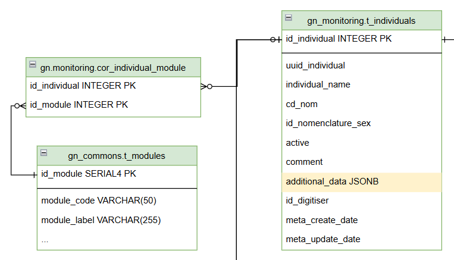
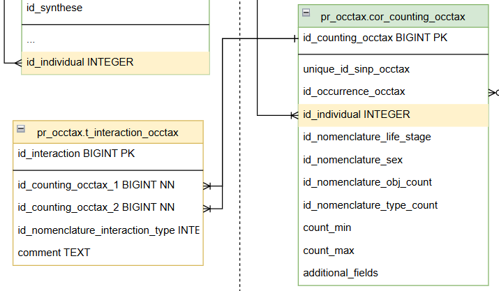
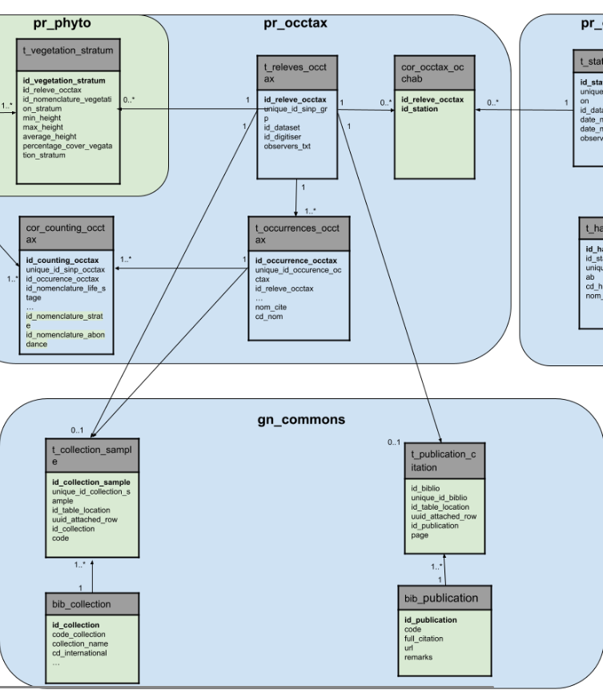
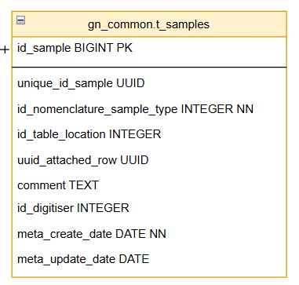
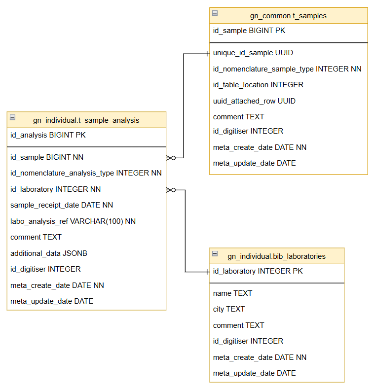
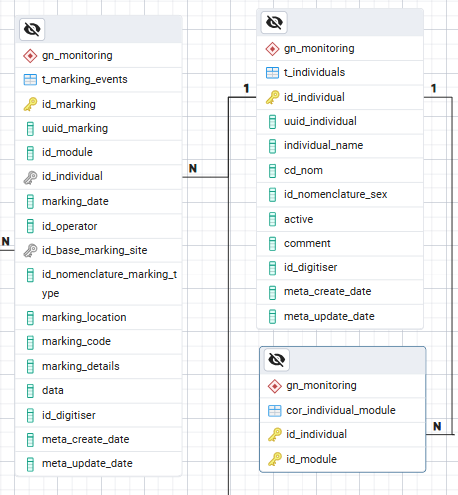
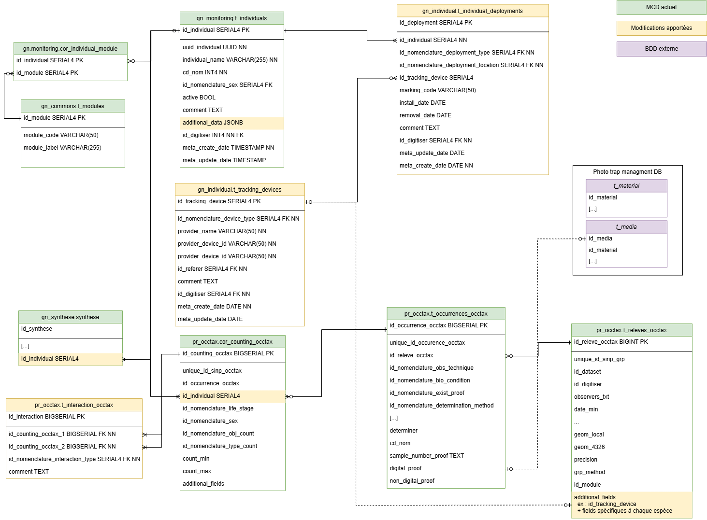
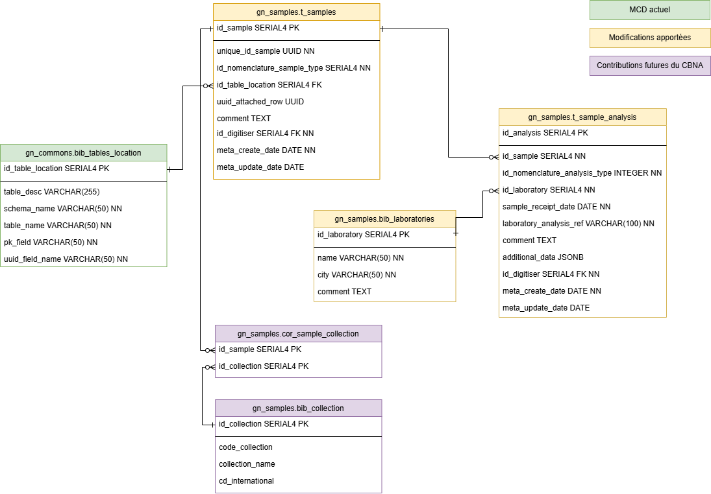

# Cahier des charges pour une solution de suivi et gestion d’individus et gestion d'échantillons

> *Projet européen Cross-DBio / Autrice : Cynthia Borot - Parc National de la Vanoise*

- [Cahier des charges pour une solution de suivi et gestion d’individus et gestion d'échantillons](#cahier-des-charges-pour-une-solution-de-suivi-et-gestion-dindividus-et-gestion-déchantillons)
  - [Contexte et besoin](#contexte-et-besoin)
  - [Objectifs](#objectifs)
  - [Architecture](#architecture)
    - [Le choix d'aller vers GeoNature](#le-choix-daller-vers-geonature)
    - [Organisation des développements](#organisation-des-développements)
      - [Module individus](#module-individus)
      - [Module des échantillons](#module-des-échantillons)
      - [Modifications dans le coeur](#modifications-dans-le-coeur)
  - [Données concernées par le projet](#données-concernées-par-le-projet)
    - [La capture](#la-capture)
    - [Les prélèvements d’échantillons](#les-prélèvements-déchantillons)
    - [Les individus](#les-individus)
    - [Les marquages](#les-marquages)
    - [Les émetteurs/balises](#les-émetteursbalises)
    - [Biométrie](#biométrie)
    - [Les résultats d'analyse d'échantillons effectués en laboratoire](#les-résultats-danalyse-déchantillons-effectués-en-laboratoire)
    - [Observations humaines d'individus-marqués](#observations-humaines-dindividus-marqués)
    - [Observation via un émetteur GPS](#observation-via-un-émetteur-gps)
    - [Observation via piège photo](#observation-via-piège-photo)
  - [Modèle de données relationnel](#modèle-de-données-relationnel)
    - [Individus](#individus)
      - [MCD : `gn_monitoring.t_individuals`](#mcd--gn_monitoringt_individuals)
      - [MCD : `gn_monitoring.cor_individual_module`](#mcd--gn_monitoringcor_individual_module)
      - [MCD : Champs ajoutés à `pr_occtax.t_releves_occtax`](#mcd--champs-ajoutés-à-pr_occtaxt_releves_occtax)
      - [MCD : Champs ajoutés à  `gn_synthese.synthese`](#mcd--champs-ajoutés-à--gn_synthesesynthese)
    - [Interactions entre individus](#interactions-entre-individus)
      - [`pr_occtax.t_interaction_occtax`](#pr_occtaxt_interaction_occtax)
    - [Echantillons](#echantillons)
      - [MCD : `gn_sample.t_samples`](#mcd--gn_samplet_samples)
    - [Analyse des échantillons](#analyse-des-échantillons)
      - [MCD : `gn_individuals.t_samples_analysis`](#mcd--gn_individualst_samples_analysis)
      - [`gn_individuals.bib_laboratories`](#gn_individualsbib_laboratories)
    - [Equipement des individus](#equipement-des-individus)
      - [`gn_individual.t_individual_deployments`](#gn_individualt_individual_deployments)
      - [MCD : `gn_individuals.t_tracking_devices`](#mcd--gn_individualst_tracking_devices)
    - [Captures](#captures)
    - [Observations faites par des observateurs non humains](#observations-faites-par-des-observateurs-non-humains)
    - [Modèle de données complet](#modèle-de-données-complet)
      - [MCD de gestion des individus](#mcd-de-gestion-des-individus)
      - [MCD de gestion des échantillons](#mcd-de-gestion-des-échantillons)
  - [Mise en relation avec le besoin initial](#mise-en-relation-avec-le-besoin-initial)
    - [Données de capture](#données-de-capture)
    - [Données de prélèvements d’échantillons](#données-de-prélèvements-déchantillons)
    - [Données sur les individus](#données-sur-les-individus)
    - [Données de marquages](#données-de-marquages)
    - [Données sur les émetteurs/balises](#données-sur-les-émetteursbalises)
    - [Données de biométrie](#données-de-biométrie)
    - [Données sur les résultats d'analyses d'échantillons effectuées en laboratoire](#données-sur-les-résultats-danalyses-déchantillons-effectuées-en-laboratoire)
    - [Données d'observations humaines d'individus marqués](#données-dobservations-humaines-dindividus-marqués)
    - [Données d'observations via émetteur type GPS](#données-dobservations-via-émetteur-type-gps)
    - [Données d'observation via piège photo](#données-dobservation-via-piège-photo)

## Contexte et besoin

Le Parc national de la Vanoise (PNV) et le Parc national du Grand Paradis (PNGP) partagent un patrimoine naturel exceptionnel, avec des milieux alpins similaires et des espèces emblématiques communes. Les populations animales, notamment le bouquetin des Alpes, se déplacent ponctuellement entre les deux territoires, ignorant les frontières administratives. Cette continuité écologique nécessite une approche transfrontalière de la gestion et du suivi de la biodiversité.

Les deux parcs ont développé, au fil des années, des protocoles de suivi rigoureux qui ont généré une masse considérable de données : plus de 1500 bouquetins capturés et marqués, des dizaines de milliers de données GPS issues du suivi télémétrique de différentes espèces (bouquetins, gypaètes barbus, aigles royaux, tétras-lyres), et une quantité croissante d'images issues des pièges photographiques. Ces données, d'une valeur scientifique inestimable, sont actuellement stockées dans des formats et sur des supports variés, rendant leur exploitation complexe et limitée.

De plus, l’avancée dans les technologies de deep learning ouvre des perspectives prometteuses pour le traitement et la valorisation des données issues de piège photo. Cependant, leur exploitation nécessite une restructuration préalable des données actuelles sous forme de base de données relationnelles selon des standards communs.

Cette harmonisation permettra non seulement d'optimiser l'exploitation des données existantes, mais aussi de faciliter le partage d'informations, via des outils simples d’usage et standardisés, entre les deux parcs puis avec la communauté scientifique.

## Objectifs

Cette application vise à :

- Rationnaliser la récolte des données de suivi des individus marqués : suivi dynamique de population, veille sanitaire, données issues après post-traitement de pièges photo …
- Centraliser ces données
- Faciliter la réalisation de bilans et l’aide à la décision : optimiser le suivi en permettant aux agents une interrogation des données existantes (repérage des sites préférentiels, connaissance de la date des dernières observations)
- Permettre, via des exports et/ou des interrogations directes à la base de données, de mieux valoriser ces données sur des cartographies faciles à réaliser et adaptées aux différents besoins (animations scolaires, partenaires)
- Faciliter la récupération des données pour les futures analyses et travaux de recherche (CMR, réseaux sociaux, analyse de reproduction, analyse spatiale, taille des groupes etc.) avec nos partenaires et futurs collaborateurs
- Proposer une consultation grand public des déplacements des individus

Elle remplacera au parc national de la Vanoise :

- Le tableur « BDD bouquetins »
- La base de données « Bouquetins marqués »
- Le portail de gestion et de visualisation des données GPS « GPS 3 vallées » (plus fonctionnel).

## Architecture

### Le choix d'aller vers GeoNature

GeoNature est actuellement le coeur du sytème d'information du parc national de la Vanoise.

Les observations occasionelles d'animaux marqués, donc d'individus, sont actuellement insérées dans la synthèse mais avec une perte d'information occasionnée par le fait que GeoNature ne puisse pas accueillir tous les éléments de l'observations.

Au regard du besoin du PNV, de son envie de faire bénéficier à d'uatres du développement de nouvelles fonctionnalités et de son souhait de contribuer plus fortement au projet de Geonature, le choix de contribuer au projet de GeoNature est une évidence.

Après divers échanges avec le Parc national des Cevennes et le Parc national des Ecrins, notre souhait est conforté par leur validation à nous appuyer sur cet écosystème pour développer les fonctionnalités dont nous avons besoin. Cela implique :

- d'élargir les réflexions pour des fonctionnalités servant l'ensemble de la communauté
- de respecter les méthodes de travail du projet
- de respecter les choix techniques

Les développements à venir s'appuieront donc sur le socle de Geonature, ainsi les technologies utilisées seront donc celles de la dernière release :

- PostgreSQL / PostGIS
- Python 3 et dépendances Python nécessaires à l’application
- Flask (framework web Python)
- Apache
- Angular 15, Angular CLI, NodeJS
- Librairies javascript (Leaflet, ChartJS)
- Librairies CSS (Bootstrap, Material Design)

### Organisation des développements

Lors de plusieurs échanges avec les principaux mainteneurs de GeoNature (Jacques Fize, Amandine Sahl, Camillle Monchicourt, Théo Lechemia), nous avons longement discuté le découpage de ces développments, coeur de GeoNature ou moduels à part. Voici dans les paragraphes suivants, l'arbitrage qui a été fait.

#### Module individus

Un nouveau module appelé `gn_module_individuals` sera développé afin d'accueillir et gérer toutes les données spécifiques aux individus (hors observations occasionelles). Elles répondent aux différents besoin du PNV, :

- La gestion des individus (CRUD),
- Les CMR avec les notions de :
  - captures
  - équipement d'individus (marquages + balises),
  - biométrie et observations sur l'état physiologiques
  - les prélèvements d'échantillons
- La gestion des analyses faites en laboratoire (CRUD)
- La gestion du matériel de suivi

**Les choix fonctionnels** ont été pensés génériques afin que la communauté des utilisateurs de GeoNature puisse adopter ces nouvelles fonctionalités :

- Gestion (CRUED) des individus
- Gestion (CRUED) des déploiements sur individus, c'est-à-dire du matériel installé sur les individus pour leur suivi (marquage, émeteurs)
- Gestion (CRUED) du matériel de suivi (principalement les émetteurs, les sustèmes de marquages pourraient aussi si besoin être gérés à ce niveau)
- Liste et géolocalisation (R) des observations d'individus qu'elles soient occasionelles ou liées à des protocoles de suivis
- Liste (R) des obsersation de type capture

**En terme d'organisation**, le choix a été fait de réaliser La quasi totalité des développements dans un module externe pour :

- Limiter l'impact sur le coeur et ainsi aussi la complexité des développement pour une équipe "junior" sur Geonature
- Ne pas bloquer l'éuipe de dev par des discussions et validations régulières de la part des mainteneurs. L'équipe aura donc plus d'autonomie dans ses développements tant dans le contenu que dans la plannification.

Dans un second temps, une fois le module éprouvé, il passera en tout ou partie dans le coeur de GeoNature.

**Côté technique** :

- La table des individus reste dans le schéma `gn_monitoring`, comme tout le backend
- Un nouveau schéma de `gn_individuals` est créé et accueillera à terme la table des individus
- Le frontend et le backend seront développés dans le module en réutilisant tant que faire ce peut les développements réalisés dans le coeur. Exemple à prendre pour le backend `occhab`, pas de recommendation pour le frontend.

#### Module des échantillons

Dans un 1er temps, un module externe de gestion des échantillons `gn_module_samples` sera développé pour les même raison de simplification et d'efficacité que le module `gn_module_individuals`.

**Les choix fonctionnels** ont été pensés génériques afin que la communauté des utilisateurs de GeoNature puisse adopter ces nouvelles fonctionalités :

- Gestion (CRUED) d'échantillons
- Association de ces échantillons à une observation (relevé, occurence ou dénombrement)
- Gestion (CRUED) des analyses réalisées sur ces échantillons
- Gestion (CRUED) des résultats d'analyses

Ce module sera imbriqué avec le projet de gestion des collections (herbiers ...) du CBNA, étroitement lié aux échantillons.

**Côté technique** :

- Un schéma spécifique `gn_sample` accuillera l'ensemble de ces données afin de ne pas alourdir le schéma `gn_common`.
- Le frontend et le backend seront développés dans le module en réutilisant tant que faire ce peut les développements réalisés dans le coeur. Exemple à prendre pour le backend `occhab`, pas de recommendation pour le frontend.

#### Modifications dans le coeur

Ces modifications seront relativements mineures si ce n'est, côté frontend, d'intégrer la possibilité de sélectionner un individus dans le dénombrement.

Nous aurons donc comme modifications à apporter :

1. L'intégration de la notion d'individus au niveau du dénombrement.
2. La possibilité dans la synthese de filtrer par individus
3. La possibilité de rattacher un échantillon à un relevé, une occurence ou un dénombrement
4. Ajout des notions d'interaction entre dénombrements

## Données concernées par le projet

Les données relatives aux individus devront être centralisées dans une base de données relationnelle, permettant de stocker toutes les données listées ci-après.

### La capture

- Nom de/des personnes ayant capturé
- Géolocalisation
- Lieu-dit
- Date de capture
- Type de capture
- Température
- Poids
- Rythme cardiaque
- Echographie
- Anesthésie / antidote :
  - Nombre de tests injection (=nb tirs)
  - Distance
  - Heure injection anesthésiant
  - Localisation injection
  - Produit anesthésiant
  - Posologie
  - Délais : Type de délais (perte posture, coucher, sommeil, maîtrise, réaction capture, relevé tête, déplacement) + unité + valeur
  - Heure injection antidote
  - Produit antidote
  - Observations

Pour comprendre comment ont été implémentés ces champs en BDD, cf le tableau de correspondance suivant : [Données de capture](#données-de-capture)

### Les prélèvements d’échantillons

Les prélèvements sont réalisés lors de capture ou lors d’une observation d'indices de présence.

- Type de prélèvement (nomenclature : sang, carcasse, selles, urines, plumes, poils …)
- Date de prélèvement
- Identifiant

Pour comprendre comment ont été implémentés ces champs en BDD, cf le tableau de correspondance suivant : [Données de prélèvements d’échantillons](#données-de-prélèvements-déchantillons)

### Les individus

La notion d'individus ne concerne que la faune. Ces données sont immuables dans le temps.

- Nom
- Identifiant unique
- Espèce
- Année de naissance
- Sexe (peut être optionnel selon l’espèce)
- Population / sous-population

Pour comprendre comment ont été implémentés ces champs en BDD, cf le tableau de correspondance suivant : [Données sur les individus](#données-sur-les-individus)

### Les marquages

Les marquages sont réalisés sur l’animal lors des captures / recaptures. Un individu peut posséder plusieurs marquages

- Type de marquage : Collier, boucles, peinture, encoches …
- Caractéristiques du marquage (nomenclature : couleur, lettre)
- Localisation du marquage sur l’animal : oreille droite, oreille gauche, cou, carcasse, aile droite …
- Remarques

Pour comprendre comment ont été implémentés ces champs en BDD, cf le tableau de correspondance suivant : [Données de marquages](#données-de-marquages)
  
### Les émetteurs/balises

Il est question des émetteurs installés sur l'animal. Ces données n'étant pas encore traitées au sein du PNV, cette liste de champs provient de réflexions avec le PNGP.

- Type d’émetteur : balise GPS, collier GPS, collier VHF …
- Informations techniques : (Marque, modèle, batterie …)
- Date de pose
- Géolocalisation lors de la pose
- Date de retrait
- Géolocalisation lors du retrait
- Référentiel géographique

Pour comprendre comment ont été implémentés ces champs en BDD, cf le tableau de correspondance suivant : [Données sur les émetteurs/balises](#données-sur-les-émetteursbalises)
  
### Biométrie

Cela concerne les données de biométrie réalisées lors des captures et recaptures.

- Date des mesures
- Mesures :
  - Localisation de la mesure sur l’animal (nomenclature)
  - Mesure
  - Unité de mesure (nomenclature)

Pour comprendre comment ont été implémentés ces champs en BDD, cf le tableau de correspondance suivant : [Données de biométrie](#données-de-biométrie)

### Les résultats d'analyse d'échantillons effectués en laboratoire

- Type d’analyse (nomenclature : sérologie, test gestation, génétique, coprologie, autopsie …)
- Date de réception au laboratoire
- Nom du laboratoire (nomenclature)
- Référence de dossier transmis par le laboratoire
- Mode de conservation de l’échantillon ou du cadavre entier (nomenclature)
- Commentaires

La liste suivante pourra évoluer dans le temps.

Sérologie :

- Virus recherchés :
  - Nom du virus (nomenclature)
  - Résultat
  
Tests de gestation :

- Type de dosage (nomenclature)
- Valeurs

Génétique :

- Données relatives à l’empreinte génétique
- Informations de filiation

Autopsie :

- Date mort présumée
- Etat cadavre (nomenclature)
- Etat physiologique (doublon avec observation visuelles ?)
- Statut reproducteur
- Synthèse lésionnelle + harmonisée
- Affection / virus / maladies :
  - Type
  - Résultat
- Causes mort (+ respi cause mort)
- Evolutions terminales
- Découvertes
- Matrices bact, Nb de matrices bact
- Bactério P
- Bactéries aéro 1 à 7, bactéries anaéréo 1 et 2
- Parasito directe
- Coproscopie
- VIRP / Myco/ Autre

Pour comprendre comment ont été implémentés ces champs en BDD, cf le tableau de correspondance suivant : [Données sur les résultats d'analyses d'échantillons effectuées en laboratoire](#données-sur-les-résultats-danalyses-déchantillons-effectuées-en-laboratoire)

### Observations humaines d'individus-marqués

- Géolocalisation
- Identifiant observateur (identifiant Geonature)
- Etat physiologique
- Interaction entre individus
  - Suitée
  - Identifiants d’autres individus marqués
  - Nombre d’individus du groupe observé (dont les marqués)
    - Sexe
    - Classe d’âge
    - Nombre
  - Caractérisation de l’interaction entre 2 individus
- Autres observations :
  - Type observation (dyspnee, jetage, kerato, toux …)
  - Valeur (nomenclature)

Pour comprendre comment ont été implémentés ces champs en BDD, cf le tableau de correspondance suivant : [Données d'observations humaines d'individus marqués]((#données-dobservations-humaines-dindividus-marqués))

### Observation via un émetteur GPS

- Identifiant de l'émetteur ou de la balise
- Individu
- Géolocalisation (point)
- Date + heure
- Température contre l'animal
- Autres informations dépendantes des émetteurs

Pour comprendre comment ont été implémentés ces champs en BDD, cf le tableau de correspondance suivant : [Données d'observations via émetteur](#données-dobservations-via-émetteur)

### Observation via piège photo

- Identifiant du piège photo
- Espèce
- Dénombrement
- Géolocalisation
- Date + heure
- Méthode de détermination (humain ou algorithme)
- Autres informations d'observation

Pour comprendre comment ont été implémentés ces champs en BDD, cf le tableau de correspondance suivant : [Données d'observation via piège photo](#données-dobservation-via-piège-photo)

## Modèle de données relationnel

Dans la présentation du modèle de données ci-après, nous nous efforçons d'expliquer la généricité des choix opérés.

### Individus

Depuis la version 2.16.0 du cœur de geonature et de la version 1.1.0 du module `gn_module_monitoring`, la notion d’individu est rajoutée pour les protocoles de suivi avec l’ajout des tables `t_individuals`, `cor_individual_module` et `t_marking_events` (issue [#213](https://github.com/PnX-SI/gn_module_monitoring/issues/213)).

Le module s'appuiera donc sur les tables `gn_module_monitoring.t_individuals` et `cor_individual_module` pour la gestion des individus. Un champ `additional_data` est ajouté à la table `gn_module_monitoring.t_individuals` afin de permettre l'ajout de données spécifiques à une espèce, non valable pour l'ensemble des individus.

*Schéma de liaison entre les tables `gn_monitoring.t_individuals`, `gn_monitoring.core_individual_module` et `gn_commons.t_module`* :



La modification du modèle de données proposée doit permettre aussi d’associer un ou plusieurs individus à une observation occasionnelle.

Ainsi pour la faune, le dénombrement rattaché à l'occurence (au taxon) pourra porter sur un ou plusieurs individus de l'espèce concernée : nous pouvons ainsi ajouter un champ `id_individual` à la table `pr_occtax.t_releves_occtax` qui fera référence à la table des individus. Cette modification sera aussi à répercuter dans la table `gn_synthese.synthese`. Cette modification sera à répercuter dans certains trigger de la synthese.

*Tables `gn_synthese.synthese` et `pr_occtax.cor_counting_occtax`* :


#### MCD : `gn_monitoring.t_individuals`

| Champs | Type | Contrainte | Détail |
| :---- | :---- | :---- | :---- |
| id_individual | SERIAL4 | PK | Identifiant de la table |
| uuid_individual | UUID | NOT NULL | Identifiant unique et universel de l'individu |
| individual_name | UUID | NOT NULL | Nom ou code de l'individu |
| cd_nom | INT4 | NOT NULL | Code du taxon |
| id_nomenclature_sex | INT4 | FK | Identifiant de la nomenclature permettant de définir le sexe, lié au champ `id_nomenclature` de la table `ref_nomenclatures.t_nomenclatures` |
| active | BOOL | - | Indique si l'individu est actif ou non (mort) |
| comment | TEXT | - | Commentaire |
| id_digitiser | INTEGER | FK, NOT NULL | Identifiant de la personne ayant saisi l'enregistrement, lié au champ `id_role` de la table `utilisateurs.t_roles` |
| meta_create_date | DATE | NOT NULL | Date de création de l'enregistrement |
| meta_update_date | DATE | - | Date de la dernière mise à jour de l'enregistrement |

#### MCD : `gn_monitoring.cor_individual_module`

| Champs | Type | Contrainte | Détail |
| :---- | :---- | :---- | :---- |
| id_individual | INT4 | PK,FK | Identifiant d'un individu lié à `gn_monitoring.t_individuals` |
| id_module | INT4 | PK,FK | Identifiant d'un module lié à `gn_common.t_module` |

#### MCD : Champs ajoutés à `pr_occtax.t_releves_occtax`

| Champs ajoutés | Type | Contrainte | Détail |
| :---- | :---- | :---- | :---- |
| id_individual | INT4 | FK | Identifiant d'un individu de la table `gn_monitoring.t_individuals` |

#### MCD : Champs ajoutés à  `gn_synthese.synthese`

| Champs ajoutés | Type | Contrainte | Détail |
| :---- | :---- | :---- | :---- |
| id_individual | INTEGER | FK | Identifiant d'un individu de la table `gn_monitoring.t_individuals` |

### Interactions entre individus

Pour le suivi des populations, la notion d'interaction entre individus peut-être une niche d'informations. Dans notre contexte il s'agirait de qualifier l'interaction, lors d'une observation entre 2 individus de même espèce ou nom.

L'interaction peut aussi, par exemple, être intéressante à relever entre un invertébré et son hôte.

La notion d'interaction entre individus étant générique nous créons donc une table `pr_occtax.t_interaction_occtax` permettant de caractériser l'interaction entre 2 entrées de la table `pr_occtax.cor_counting_occtax`, c'est à dire entre 2 occurences (indépendament du taxon) d'un même relevé :

*Shéma de liaison entre les tables `pr_occtax.t_interaction_occtax` et `pr_occtax.cor_counting_occtax`* :



#### `pr_occtax.t_interaction_occtax`

Table permettant de caractériser l'interaction entre 2 occurances de taxon.

| Champ | Type | Contrainte | Détail |
| :---- | :---- | :---- | :---- |
| id_interaction | BIGINT | PK, NOT NULL | Identifiant unique de l'intéraction |
| id_counting_occtax_1 | BIGINT | FK, NOT NULL | Identifiant de la 1ère occurence concernée par l'interaction lié au champ `id_counting_occtax` de la table `cor_counting_occtax` |
| id_counting_occtax_2 | BIGINT | FK, NOT NULL | Identifiant de la 2nd occurence concernée par l'interaction lié au champ `id_counting_occtax` de la table `cor_counting_occtax` |
| id_nomenclature_interaction_type | INTEGER | FK, NOT NULL, CHECK | Identifiant du type d'intéraction lié au champ `id_nomenclature` de la table `ref_nomenclatures.t_nomenclatures` |

### Echantillons

Des échantillons peuvent être collectés sur le terrain dans différents contextes :

- Lors de la capture d'un individu (CMR), la prise d'échantillons est faite sous forme de prise de sang par exemple
- Lors de l'observation d'indices de présence sur le terrain, des échantillons peuvent être de même prélevés afin d'être analysés en laboratoire (génétique), le taxon n'est alors pas forcément connu
- Lors d'un relevé botanique et/ou entomologique, des échantillons peuvent être récoltés afin de réaliser la détermination des espèces au microscope.

Notre modèle doit satisfaire tout ces cas d'usage. A la lecture du travail porté par le CBNA (issue [#3603](https://github.com/PnX-SI/GeoNature/issues/3603)), nous repartirons de leurs réflexions pour implémenter notre besoin. Ce modèle permet d’associer un échantillon `gn_common.t_collection_sample` à tout type d'objet via les champs `id_table_location` et `uuid_attached_row`.

*Extrait du cahier des charges 'Relevés floristiques et phytosociologiques' du CBNA* :


  
Nous nommerons la table de stockage des échantillons `gn_common.t_samples` (et non `gn_common.t_collection_sample`) car son usage se fera au dela de la notion de collection. Cela sera convenu avec le CBNA

*Shéma de la table `gn_common.t_samples`* :



#### MCD : `gn_sample.t_samples`

Table stockant les informations sur les échantillons prélevés sur le terrain.

| Champs | Type | Contrainte | Détail |
| :---- | :---- | :---- | :---- |
| id_sample | BIGINT | PK, NOT NULL | Identifiant unique de l'échantillon |
| unique_id_sample | UUID | NOT NULL | Identifiant unique et universel de l'échantillon. Utilisé lors de transmission des données à d'autres établissement afin d'éviter les doublons. |
| id_nomenclature_sample_type | SERIAL4 | PK, NOT NULL | Identitifiant du type d'échantillon récolté (ex : cadavre, crottes, plantes, terre) lié au champ `id_nomenclature` de la table `ref_nomenclatures.t_nomenclatures` |
| id_table_location | INTEGER | FK | Identifiant de la table à laquelle est rattaché cet échantillon lié au champ `id_table_location`de la table `gn_commons.bib_table_location`. Cette méthode reprend ce qui a été fait pour la gestion des médias qui peuvent être associés à toute entrée d'une table disposant d'un uuid. |
| uuid_attached_row | UUID | - | Ce champ est étroitement lié à l'id_table_location. Cet uuid est celui de l'entrée de la table mentionnée via le id_location_table. |
| comment | TEXT | - | Commentaires |
| id_digitiser | SERIAL4 | FK, NOT NULL | Identifiant de la personne ayant saisi l'enregistrement, lié au champ `id_role` de la table `utilisateurs.t_roles` |
| meta_create_date | DATE | NOT NULL | Date de création de l'enregistrement |
| meta_update_date | DATE | - | Date de la dernière mise à jour de l'enregistrement |

### Analyse des échantillons

Aujourd'hui, au Parc national de la Vanoise, les résultats d'analyses sont, pour la plus part, compilés dans un fichier xsl. Dans d'autres structures, ces fiches sont très souvant classées sous forme papier et/ou numérisées en format pdf.

Le projet est de faciliter l'exploitation des données en enregistrant ces fiches dans une table unique dont la plupart des champs seront configurables via le champ json `additional_data` de la table `gn_individuals.t_sample_analysis`.

La bibliothèque `gn_individuals.bib_laboratories` permettra de stocker de façon propre les noms des laboratoires d'analyse.

*Shémas de liaison entre les tables `gn_common.t_samples`, `gn_individuals.t_samples_analysis` et `gn_individuals.bib_laboratories`* :



#### MCD : `gn_individuals.t_samples_analysis`

Table de stockage des résultats d'analyses en provenane de laboratoires.

| Champs | Type | Contrainte | Détail |
| :---- | :---- | :---- | :---- |
| id_analysis | SERIAL4 | PK | Identifiant unique de l'analyse |
| id_sample | SERIAL4 | FK, NOT NULL | Identifiant de l'échantillon concerné par l'analyse pointant vers gn_commons.t_samples |
| id_nomenclature_analysis_type | SERIAL | FK, NOT NULL, CHECK | Identifiant du type d'analyse (ex : génétique, sérologie, ...) lié au champ `id_nomenclature` de la table `ref_nomenclatures.t_nomenclatures` |
| id_laboratory | SERIAL4 | FK, NOT NULL | Identifiant du la boratoire e ncharge de l'analyse lié au champs `id_laboratory` de la table `bib_laboratories` |
| sample_receipt_date | DATE | NOT NULL | Date de réception de l'échantillon au laboratoire |
| labo_analysis_ref | VARCHAR(100) | NOT NULL | Identifiant de l'analyse au seinb du laboratoire |
| comment | TEXT | - | Commentaires |
| additional_data | JSONB | - | Données non génériques associées à l'analyse : les résulstats d'analyse, très différents d'un type d'analyse à un autre seront stockés ici |
| id_digitiser | SERIAL4 | FK, NOT NULL | Identifiant de la personne ayant saisi l'enregistrement, lié au champ `id_role` de la table `utilisateurs.t_roles` |
| meta_create_date | DATE | NOT NULL | Date de création de l'enregistrement |
| meta_update_date | DATE | - | Date de la dernière mise à jour de l'enregistrement |

#### `gn_individuals.bib_laboratories`

Bibliothèque listant les laboratoires d'analyses.

| Champs | Type | Contrainte | Détail |
| :---- | :---- | :---- | :---- |
| id_laboratory | SERIAL4 | PK | Identifiant unique du laboratoire |
| name | TEXT | NOT NULL | Nom complet du laboratoire |
| city | TEXT | NOT NULL | Nom de la ville où est implanté le laboratoire |
| comment | TEXT | - | Commentaires |
| id_digitiser | SERIAL4 | FK, NOT NULL | Identifiant de la personne ayant saisi l'enregistrement, lié au champ `id_role` de la table `utilisateurs.t_roles` |
| meta_create_date | DATE | NOT NULL | Date de création de l'enregistrement |
| meta_update_date | DATE | - | Date de la dernière mise à jour de l'enregistrement |

### Equipement des individus

La notion de capture ne concerne que les individus. Nous souhaitons dissocier les informations :

- liées directement à la capture,
- concernant la mise en place d'équipements (marquages, balises ...) sur les individus,
- concernant les constats faits sur l'individu lors de la capture

Depuis la version 2.16.0 de GeoNature, il existe une table `gn_monitoring.t_marking_events` qui permet le stockage d’évènements de marquage pour le monitoring :

*Shémas de liaison entre les tables `gn_monitoring.t_individuals` et `gn_monitoring.t_marking_events`* :



Nous faisons le choix de partir sur un nouveau modèle de données pour la gestion des appareils de suivis car la table `gn_monitoring.t_marking_events` ne répond pas à la possibilité de définir plusieurs dispositifs de suivis (marquage, émetteur) par individu. Nous passerons alors par la création :

- de la table`gn_individuals.t_individual_deployments` pour la gestion des éd"ploiements de dispositifs de suisi. Son modèle permet aussi le saisie de la nouvelle génération de collier GPS faisant office de marquage et de balise,
- de la table `gn_individuals.t_tracking_devices` pour l'enregistrement des dispositifs de suivis. Cette table servira principalement pour les émetteurs, rares sont les fois où les marquages sont réutilisés donc nécessitant une centralisation de la donnée.

*Schéma des tables `gn_monitoring.t_individuals`, `gn_individuals.t_individual_deployments` et `gn_individuals.t_tracking_devices` associées au déploiement d'un dispositif de suivi* :


#### `gn_individual.t_individual_deployments`

Table des déploiements d'équipements (dispositifs de suivi, marquage) sur un individu lors d'une capture.

| Champs | Type | Contrainte | Détail |
| :---- | :---- | :---- | :---- |
| id_deployment | SERIAL4 | PK | Identifiant unique du déploiement |
| id_individual | SERIAL4 | FK, NOT NULL | Identifiant de l'individu concerné par le déploiement, lié au champ `id_individual` de la table `gn_monitoring.t_individuals` |
| id_nomenclature_deployment_type | SERIAL4 | FK, NOT NULL, CHECK | Identifiant du type de déploiement (ex : boucle, collier, décoloration, peinture, dispositif de suivi) lié au champ `id_nomenclature` de la table `ref_nomenclatures.t_nomenclatures` |
| id_nomenclature_deployment_location | SERIAL4 | FK, NOT NULL, CHECK | Identifiant du lieu du déploiement (ex : oreille droite, encolure, aile gauche, carapasse ...) lié au champ `id_nomenclature` de la table `ref_nomenclatures.t_nomenclatures` |
| id_tracking_device | SERIAL4 | FK | Identifiant du dispositif de suivi déployé sur l'individu, lié au champ `id_tracking_device` de la table `gn_individuals.t_tracking_devices` |
| marking_code | VARCHAR(100) | - | Caractéristique du marquage (ex : lettre, couleur, nom de la plûme décolorée ...) |
| install_date | DATE | NOT NULL | Date de mise en place de l'équipement (marquage ou dispositif de suivi). |
| removal_date | DATE | - | Date de retrait de l'équipement (marquage ou dispositif de suivi). |
| comment | TEXT | - | Commentaires |
| additional_data | JSONB | - | Données non génériques associées au déploiement. Ex : lieu-dit |
| id_digitiser | SERIAL4 | FK, NOT NULL | Identifiant de la personne ayant saisi l'enregistrement, lié au champ `id_role` de la table `utilisateurs.t_roles` |
| meta_create_date | DATE | NOT NULL | Date de création de l'enregistrement |
| meta_update_date | DATE | - | Date de la dernière mise à jour de l'enregistrement |

#### MCD : `gn_individuals.t_tracking_devices`

Table des dispositifs de suivi.

| Champs | Type | Contrainte | Détail |
| :---- | :---- | :---- | :---- |
| id_tracking_device | SERIAL4 | PK | Identifiant unique du dispositif de suivi |
| id_nomenclature_device_type | SERIAL4 | FK, NOT NULL, CHECK | Identifiant type de dispositif (ex : balise GPS, balise ARGOS, piège photo ...) lié au champ `id_nomenclature` de la table `ref_nomenclatures.t_nomenclatures` |
| id_referer | SERIAL4 | FK, NOT NULL | Identifiant de la personne responsable du matériel, lié au champ `id_role` de la table `utilisateurs.t_roles` |
| provider_name | VARCHAR(50) | - | Nom du fournisseur |
| provider_device_id | VARCHAR(50) | - | Identifiant du dispositif de suivi chez le fournisseur  |
| comment | TEXT | - | Commentaires |
| id_digitiser | SERIAL4 | FK, NOT NULL | Identifiant de la personne ayant saisi l'enregistrement, lié au champ `id_role` de la table `utilisateurs.t_roles` |
| meta_create_date | DATE | NOT NULL | Date de création de l'enregistrement |
| meta_update_date | DATE | - | Date de la dernière mise à jour de l'enregistrement |

### Captures

Après plusieurs temps de réflexions, nous sommes arrivés à la conclusion que les captures étaient des observations particulières. Nous nous appuyerons donc sur la table `pr_occtax.t_releves_occtax` pour renseigner ces informations de captures :

- Le champ additional_data sera utilisé pour rentrer des informations de capture spécifiques à chaque taxon.
- Ces observations de captures seront associé à un jeu de donné identifié comme capture dans la table `gn_meta.t_datasets`
- Ce relevé disposera d'une occurance qui comportera n dénombrements, un par individu capturé.

Ainsi nous nous appuyerons sur ce qui existe déjà, en faisant gagner du temps en développement et en maintenance pour la suite.

### Observations faites par des observateurs non humains

Au regard de notre souhait de stocker toutes nos données d'observation dans GeoNature, nous devons avoir la possiblité d'enregistrer toutes les "observations" réalisées par des dispositifs de suivi, type balises GPS ou pièges photo.

Nous faisons le choix, conseillés par l'équipe des mainteneurs de GeoNature, de créer pour cela un rôle dédié à ce type d'observations qui pourrait se nommer "Dispositif de suivi".

Afin de pouvoir identifier quel est le capteur ou émetteur qui a "produit" la donnée, nous ajouterons un champ additionnel "id_tracking_device" dans le champ `additional_fields` de la table `pr_occtax.t_releves_occtax` via le module de gestion des champs additionnels.

Ces relevés seront associés à des jeux de données spécifiques.

### Modèle de données complet

Le modèle de données, ci-dessous, ne reprends pas l'ensemble du modèle de GeoNature. Il ne présente que les nouvelles tables créées pour le projet ainsi que les tables principales du modèle actuel qui leurs sont liées (en vert) et sont nécessaires à la compréhension du modèle. Les champs créés dans des tables existantes sont surlignés en orange.

#### MCD de gestion des individus

*Schéma complet du MCD de gestion des individus* :



#### MCD de gestion des échantillons

*Schéma complet du MCD de gestion des échantillons* :



## Mise en relation avec le besoin initial

Via les tableaux de correspondance suivant, nous validons que l'ensemble des données (des champs) listées dans le paragraphe [Données concernées par le projet](#données-concernées-par-le-projet) trouvent leur emplacement dans le modèle de données proposé ci-dessus.

### Données de capture

| Donnée initiale | Schéma / table | Champ | Explication |
| :---- | :---- | :---- | :---- |
| Nom de/des personnes ayant capturé | pr_occtax.t_releves_occtax | observers_txt | |
| Géolocalisation | pr_occtax.t_releves_occtax | geom_local, geom_4326 | |
| Lieu-dit | pr_occtax.t_releves_occtax | additional_data | `{[...],"locality": "xxx"}` |
| Date de capture | pr_occtax.t_releves_occtax | date_min, date_max, hour_min, hour_max, | |
| Type de capture | pr_occtax.t_releves_occtax | additional_data | `{[...],"capture_type": "000"}` |
| Température | pr_occtax.t_counting_occtax | additional_data | `{[...],"temperature": "000"}` |
| Poids | pr_occtax.cor_counting_occtax | additional_data | `{[...],"weight": "000"}` |
| Rythme cardiaque | pr_occtax.cor_counting_occtax | additional_data | `{[...],"heart_rate": "000"}` |
| Echographie | pr_occtax.cor_counting_occtax | additional_data | `{[...],"pregnant": "yes/no"}` |
| Anesthésie : Nombre de tirs, Distance tir, Commentaires | pr_occtax.cor_counting_occtax | additional_data | `{[...],"anesthesia_general": "xxx"}`|
| Anesthésie injection : Heure, localisation, nom produit, posologie | pr_occtax.cor_counting_occtax | additional_data | `{[...],"anesthesia_injection":"xxx""}` |
| Anesthésie réactions (x n): Type, unité, valeur | pr_occtax.cor_counting_occtax | additional_data | `{[...],"anesthesia_reaction""xxx"}` |
| Antidote : Heure injection, produit, posologie | pr_occtax.cor_counting_occtax | additional_data | `{[...],"antidote_injection":"xxx"}` |
| Commentaires  | pr_occtax.t_releve_occtax | comment | |
| Individus capturés | pr_occtax.cor_counting_occtax | id_individual | |

### Données de prélèvements d’échantillons

| Donnée initiale | Schéma / table | Champ | Explication |
| :---- | :---- | :---- | :---- |
| Type de prélèvement | gn_commons.t_samples | id_nomenclature_sample_type | |
| Date de prélèvement | pr_occtax_t_releves_occtax | date_min | |
| Identifiant | gn_commons.t_samples | id_sample | |

### Données sur les individus

| Donnée initiale | Schéma / table | Champ | Explication |
| :---- | :---- | :---- | :---- |
| Nom | gn_monitoring.t_individuals | individual_name | |
| Identifiant unique | gn_monitoring.t_individuals | id_individual | |
| Espèce | gn_monitoring.t_individuals | cd_nom | |
| Année de naissance | gn_monitoring.t_individuals | additional_data | `{[...],"birth_year": "000"}` |
| Sexe | gn_monitoring.t_individuals | id_nomenclature_sex | |
| Population / sous-population | gn_monitoring.t_individuals | additional_data | `{[...],"population": "xxx","subpopulation": "xxx"}` |

### Données de marquages

| Donnée initiale | Schéma / table | Champ | Explication |
| :---- | :---- | :---- | :---- |
| Type de marquage | gn_individuals.t_individual_deployments | id_nomenclature_deployment_type | Le marquage fait partie des équipements déployés sur l'individu |
| Caractéristiques du marquage | gn_individuals.t_individual_deployments | marking_code ou id_tracking_device | |
| Localisation du marquage sur l’animal | gn_individuals.t_individual_deployments | id_nomenclature_deployment_location | |
| Remarques | gn_individuals.t_individual_deployments | comment | |
  
### Données sur les émetteurs/balises

| Donnée initiale | Schéma / table | Champ | Explication |
| :---- | :---- | :---- | :---- |
| Type d’émetteur | gn_individuals.t_tracking_devices | id_nomenclature_device_type | Les émetteurs font parties du matériel de suivi des individus |
| Informations techniques : manufacturer, model, serial_number | gn_individuals.t_tracking_devices | comment | |
| Date de pose | gn_individuals.t_individual_deployments | install_date | |
| Géolocalisation lors de la pose | pr_occtax.t_releves_occtax | geom_local, geom_4326 | Géolocalisation de la première "observation de type capture" associée au déploiement du matériel |
| Date de retrait | gn_individuals.t_individual_deployments | removal_date |  |
| Géolocalisation du retrait | pr_occtax.t_releves_occtax | date_min | Géolocalisation de la dernière donnée d'observation |
  
### Données de biométrie

| Donnée initiale | Schéma / table | Champ | Explication |
| :---- | :---- | :---- | :---- |
| Date des mesures | pr_occtax.t_releves_occtax | date_min |  |
| Mesures : Localisation sur l’animal, mesure, unité de mesure | pr_occtax.cor_counting_occtax | additional_data | `{[...],"measures":"xxx"}` |

### Données sur les résultats d'analyses d'échantillons effectuées en laboratoire

| Donnée initiale | Schéma / table | Champ | Explication |
| :---- | :---- | :---- | :---- |
| Type d’analyse | gn_individuals.t_samples_analysis | id_nomenclature_analysis_type | |
| Date de réception au laboratoire | gn_individual.t_sample_analysis | sample_receipt_date | |
| Nom du laboratoire | gn_individuals.bib_laboratories | name | |
| Référence dues résultats transmis par le laboratoire | gn_individuals.t_sample_analysis | laboratory_analysis_ref | |
| Mode de conservation de l’échantillon | gn_common.t_samples | comment | |
| Remarques | gn_individuals.t_samples_analysis | comment | |

Les résultats d'analyses à proprement parlé seront stockés dans le champ `additional_data` de la table `gn_individual.t_sample_analysis`.

Exemple de structure du champ pour une analyse de type **Sérologie** :

```json
{
  "searched_virus": {
    "1": {   
      "name": "xxx",
      "result": "xxx",
    },
    "2": {
      "name": "xxx",
      "result": "xxx",
    },
    [...]
  }
}
```

Exemple de structure du champ pour une analyse de type **Test gestationnel** :

```json
{
  "gestational_test": {
    "1": {   
      "dosage_type": "xxx",
      "value": "xxx",
    },
    "2": {
      "dosage_type": "xxx",
      "value": "xxx",
    },
    [...]
  }
}
```

Pour les analyses de type **Génétique**, nous n'avons pas d'exemple à proposer.

Exemple de structure du champ pour une analyse de type **Autopsie** :

```json
{
  "autopsy": {
    "presumed_death_date": "000",
    "corpse_condition": "xxx",
    "physilogical_state": "xxx",
    "reproductive_status": "xxx",
    "lesion_synthesis": "xxx",
    "affection_virus_disease": {
     "1": { "type": "xxx","result": "xxx"},
     [...]
    },
    "death_cause": "xxx",
    "terminal_evolutions": "xxx",
    [...]
  }
}
```

### Données d'observations humaines d'individus marqués

| Donnée initiale | Schéma / table | Champ | Explication |
| :---- | :---- | :---- | :---- |
| Géolocalisation | pr_occtax.t_releves_occtax | geom_local, geom_4326 | |
| Identifiant observateur | pr_occtax.t_releves_occtax | observateur_txt | |
| Etat physiologique | pr_occtax.t_occurrences_occtax | id_nomenclature_bio_condition | |
| Femelle suitée | pr_occtax.t_interaction_occtax | ensemble des champs | |
| Identifiants d’autres individus marqués observés ensembles | pr_occtax.cor_counting_occtax | id_individual | Les enregistrements de chaque individu feront référence au même id_occurence_occtax |
| Nombre d’individus du groupe observé (hors marqués) distingués par sexe, classe d’âge et nombre | pr_occtax.t_counticor_counting_occtaxng_occtax | id_nomenclature_life_stage, id_nomenclature_sex, id_nomenclature_type_count | Les enregistrements de chaque groupe feront référence au même id_occurence_occtax |
| Caractérisation de l’interaction entre 2 individus  | pr_occtax.t_interaction_occtax | ensemble des champs |  |
| Observations sanitaires : Type observation et valeur  | pr_occtax.cor_counting_occtax | additional_fields | `{[...],"health_observations":{"1":{"type": "xxx","value": "xxx"},"2":{"type": "xxx","value": "xxx"},[...]}}` |

### Données d'observations via émetteur type GPS

| Donnée initiale | Schéma / table | Champ | Explication |
| :---- | :---- | :---- | :---- |
| Identifiant de l'émetteur ou de la balise | pr_occtax.t_releves_occtax | additional_fields | `{"id_tracking_device": "000"}` |
| Identifiant de l'émetteur ou de la balise | pr_occtax.cor_role_releves_occtax | id_role | Un role unique appelé "matériel" sera systématiquement associé à ces observations qui seront elles, associées à un jeu de données spécifique |
| Individu | pr_occtax.cor_counting_occtax | id_individual | |
| Géolocalisation (point) | pr_occtax.t_releves_occtax | geom_local, geom_4326 | |
| Date + heure | pr_occtax.t_releves_occtax | date_min, hour_min | |
| Température contre l'animal | pr_occtax.t_releves_occtax | comment | |
| Autres informations dépendantes des émetteurs | pr_occtax.t_releves_occtax | comment | |

### Données d'observation via piège photo

Les pièges photos ne remonteront pas seulement des informations sur les individus marqués mais sur toute espèce.

| Donnée initiale | Schéma / table | Champ | Explication |
| :---- | :---- | :---- | :---- |
| Identifiant du piège photo | pr_occtax.t_releves_occtax | additional_fields | `{"id_tracking_device": "000"}` |
| Espèce | pr_occtax.t_releves_occtax | cd_nom | |
| Individu | pr_occtax.cor_counting_occtax | id_individual | |
| Dénombrement | pr_occtax.cor_counting_occtax | tous les champs | |
| Géolocalisation | pr_occtax.t_releves_occtax | geom_local, geom_4326 | |
| Date + heure | pr_occtax.t_releves_occtax | date_min, hour_min | |
| Méthode de détermination (humain ou algorithme) | pr_occtax.t_occurences | id_nomenclature_determination_method | A renseigner différement si les photos ont été analysées par l'oeil humain ou via un algorithme |
| Autres informations d'observation | pr_occtax.t_releves_occtax | comment | |